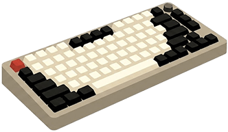

<p align="center">
  
</p>

# MODKEYS — Keyboard Configurator

A browser-based mechanical keyboard configurator and 3D visualization tool. Build, customize, and share your dream keyboard — entirely in the browser.

**[Try it live](https://modkeys.vercel.app/)**

---

## Features

- **3D keyboard preview** powered by Three.js — orbit, pan, and zoom around a fully rendered keyboard
- **Multiple layouts**: 60% Compact, 65% Standard, 75% Pro (with rotary knob)
- **Keycap profiles**: Cherry, OEM, XDA, SA, DSA, MT3, ASA — each with accurate geometry, dish, and row tilt
- **Colorways**: 19 curated presets (Claude, Gemini, Sakura, Verdant, Abyssal, Dune, Monochrome, Umbra, Moss, Contrast, Rosette, Noir, Embers, Matcha, Carbon, Vaporwave, Dracula, Blush, Honey) with full custom color support
- **Custom colors**: Fine-tune alpha, mod, and accent key colors with live hex preview
- **Per-key customization**: Custom text, font size, foreground/background colors, glow effect, image upload, and emoji marks on individual keys
- **Case & plate**: 16 case colors, 3 finishes (anodized/soft-touch/polished), 8 plate materials (aluminum/brass/polycarbonate/carbon fiber/copper/steel/POM/FR4)
- **Switches**: 10 switch types (Boba U4T, Holy Panda, Box Jade, Silent Ink, Cream, Teal, Sunset, Topaz, Emerald, Silver) — each with distinctive 3D rendering and audible click feedback (Web Audio)
- **Lighting**: Wave, Static, Breathe, or Off — with color picker and brightness control; underglow and per-key glow with GLSL shaders
- **Extras**: Rotary knob, coiled cable (3D tube geometry), walnut wrist rest (extruded mesh), switch lubing service
- **Undo/Redo**: Full history stack (up to 50 states) with keyboard shortcuts
- **Export**: KLE (Keyboard Layout Editor) JSON, SVG template for manufacturing, full spec sheet JSON
- **Share**: URL-based state sharing (base64-encoded in the hash fragment)
- **Presets**: 15 featured builds you can load instantly
- **Save builds**: Save your creations to the gallery and browse them later
- **Dark/Light theme**: Toggle between themes with adjusted 3D lighting

---

## Tech Stack

| Layer | Technology |
|---|---|
| **Build** | [Vite 6](https://vitejs.dev) |
| **JavaScript** | Vanilla ES Modules (no framework) |
| **3D** | [Three.js r170](https://threejs.org) — WebGL, PCFSoft shadows, PMREM environment, custom GLSL shaders |
| **Animation** | [GSAP 3.12](https://gsap.com) |
| **Audio** | Web Audio API (procedural synthesis, no audio files) |
| **Emoji** | [Twemoji](https://github.com/jdecked/twemoji) via CDN |
| **CSS** | Vanilla CSS with custom properties (theming), CSS Grid layout |
| **Export** | KLE JSON, SVG templates, JSON spec sheets |

---

## Project Structure

```
index.html              Main SPA shell
src/
  css/
    variables.css       CSS custom properties (light/dark theme)
    layout.css          Grid layout, sidebar, topbar, content grid
    components.css      All component styles (pills, toolbar, cards, modals, key editor, toggles, loader)
  js/
    app.js              Entry point — bootstraps all modules and the render loop
    core/
      state.js          Global mutable state + serialization
      scene.js          Three.js scene, renderer, materials, GLSL shaders
      keyboard.js       Keyboard geometry, keycap profiles, legend textures
      controls.js       Camera controls, pointer interaction, raycasting, key picking
      update.js         State → 3D pipeline, undo/redo orchestration
      history.js        Undo/redo stack (max 50)
      shrinker.js       URL serialization (base64)
      perKey.js         Per-key override store
      imageLoader.js    Image loading, canvas text rendering
    data/
      layouts.js        Keyboard layout definitions (60%, 65%, 75%)
      colorways.js      19 colorway presets + panel swatches
      components.js     Cases, finishes, plates, switches, materials, extras, profiles, light colors
      presets.js        15 featured build presets (with brand marks)
      art.js            Vector mark drawing functions + brand mark SVGs + emoji definitions
    ui/
      panels.js         Right panel rendering, key editor popover
      modals.js         Modal/drawer system (Gallery, Library, Switches, Accessories)
      theme.js          Light/dark theme toggle + 3D lighting adjustment
      toast.js          Toast notifications
      sound.js          Web Audio switch sound synthesis
    export/
      kle.js            KLE JSON export
      svg.js            SVG template export
      spec.js           Spec sheet JSON export (with per-key image data)
```

---

## Usage

### Builder
The main view shows a 3D keyboard. Use the sidebar to navigate configuration sections:
**Layout** → **Keycaps** → **Switches** → **Case** → **Plate** → **Lighting** → **Extras**

### 3D Controls
- **Orbit**: Click and drag (default)
- **Pan**: Toggle the hand icon or hold Shift + drag
- **Zoom**: Scroll wheel or pinch (touch)
- **Views**: 3D, Explode, Top, Side, Front via the pill switcher above the canvas (desktop) or the icon bar pinned to the stage bottom (mobile)

### Mobile

On phones and tablets the configurator swaps in a dedicated mobile shell at boot
(via `matchMedia`). The experience is purpose-built, not a shrunk desktop:
- **View pills** render as a bottom icon bar — cube (3D), two offset squares
  (Explode), square + down-arrow (Top), tall rectangle + right-arrow (Side),
  rectangle + up-arrow (Front) — so all five fit portrait screens.
- **Section tabs** along the bottom switch Layout → Keycaps → Switches →
  Case → Plate → Lighting → Extras.
- **Material sounds**: tapping a key plays the switch sound; PBT keeps the
  deep thock, while ABS and Ceramic add a brighter resonance layer.
- **Safe-area + dvh** handling keeps controls clear of notches and home bars.

### Per-key Customization
Double-click any key on the 3D board to open the key editor. Customize text, colors, glow, and images.

### Sharing
Click the share icon in the toolbar to copy a URL that encodes your current build state.

---

## License

MIT

---

*Built with curiosity by [nur](https://github.com/anomalyco)*
